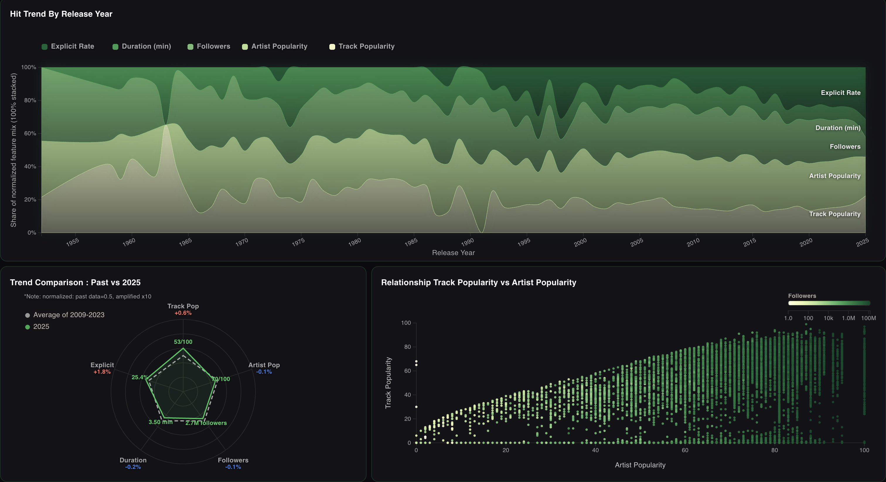
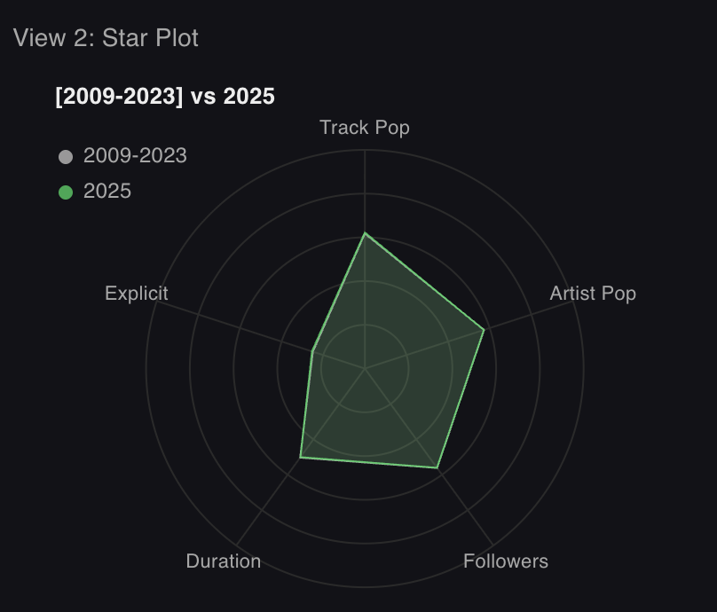

## Visual for HW2

## Dataset

Spotify :
<https://www.kaggle.com/datasets/wardabilal/spotify-global-music-dataset-20092025>

Files used in this project:

- track_data_final.csv (historical popular tracks; 2009-2023 hits)
- spotify_data_clean.csv (recent tracks snapshot; 2025 hits)

### Template

I used given React templates for this project.

## User Goals

This dashboard is designed for independent music artists who want to understand what characteristics make recent songs popular on Spotify.

    Users can learn:
    1. How the sound profile of popular songs has changed over time

    2. How artist popularity relates to track popularity among popular songs

    3. How the audio features of recent hits differ from older popular tracks
    

## View

1. Main (View 1): 100% stacked area of release-year trends (composition)
   - Group by release year (album_release_date)
   - Compute yearly averages for each proxy "feature" and normalize per feature (0-1), then convert to per-year shares (sum=100%)
   - Y-axis shows % share of the normalized feature mix (not an absolute score)

2. Bottom-left (View 2): Star Plot (Radar) comparison between datasets (past vs 2025 snapshot)
   - Gray = track_data_final.csv baseline (fixed at 0.5 for readability)
   - Green vertex labels show 2025 raw means; each axis also shows +/- delta% vs baseline
   - Note: this view uses a normalized delta visualization (baseline=0.5, delta scaled,and amplified), and is intended to highlight small differences

3. Bottom-right (View 3): Scatter plot (artist_popularity vs track_popularity)
   - Points are colored by artist_followers

## Design Choices

1. Amplify the difference in view 2

The numerical difference was too small as the shown graph below, so I decided to amplify the differences.  
 

2. Design palette
   use [d3.interpolateYlGn(t)](https://d3js.org/d3-scale-chromatic/sequential#interpolateYlGn) to represent spotify theme
   

