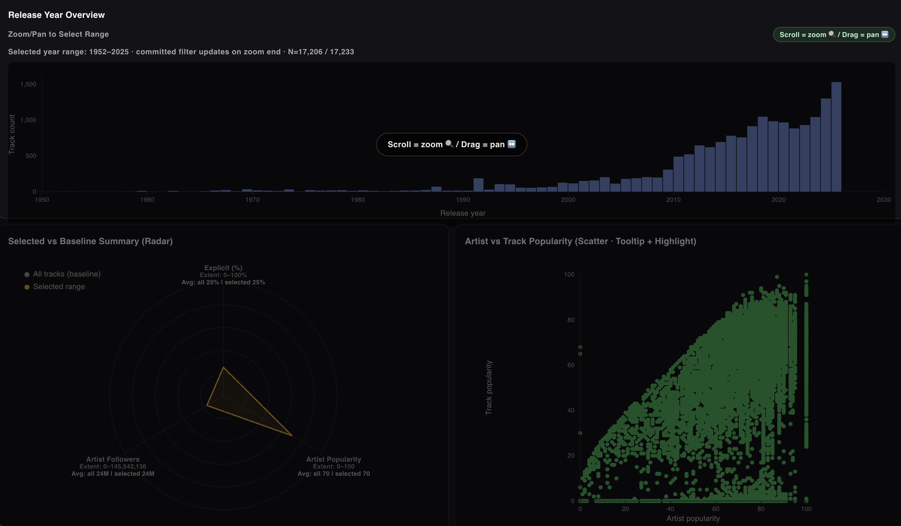
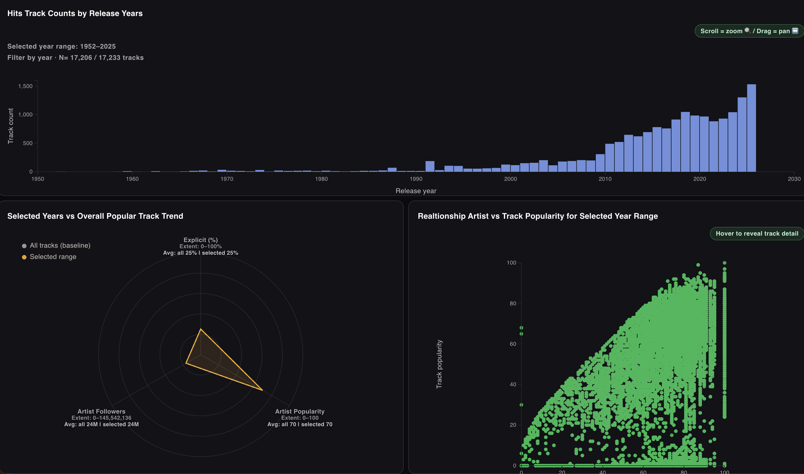
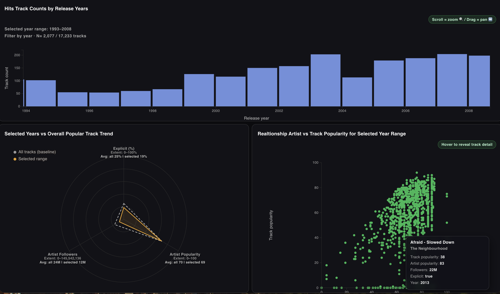

## Communicative Goal (Target Audience)

Help emerging music artists understand how tracks from a similar era to their own work perform (e.g., explicit vs. non-explicit), and how much artist popularity and promotion relate to a track's success when releasing new music.

## Through-Line (Core Message / Meta Concept)

Narrowing the time window reveals how track traits connect to performance, and how artist popularity amplifies success.

## Story Sequence



### Story Piece 1: Context Overview (Release-Year Histogram)




- Establish the full timeline of releases.
- Invite users to choose a year range to investigate.

### Story Piece 2: Focus + Details (Scatter + Radar)




- Show how **artist_popularity** and **track_popularity** relate in the chosen range.
- Summarize how the selected range differs from the baseline in key averages.

## User Interactions per Story Piece

- Story Piece 1 (Context): zoom/pan on the histogram to set the year range; releasing the zoom updates the linked views.
- Story Piece 2 (Focus + Details): hover scatter points to reveal tooltips and highlight; filtered selection updates the radar comparison.

## Design Choices

1. Focus + Context layout

View 1 (bar chart) is intentionally simple and stable (context). Views 2/3 change in response to the selected domain (focus/details) to support drill-down.

2. Animated transitions

- Have user instruction first
- Then chamge rader and scatter plot view according to the zoom in/out in the bar charts view
- so that users can intuitively select the year-range

3. Encodings

- Keep points a fixed size to reduce visual noise; show extra info in the tooltip.
- (I was going to change the scatter plot size by followers, but I choce simpleness to visualize main message in the scatter plots.)

4. Color

- Retain Spotify-inspired greens to indicate whose dataset user see, but vary colors across views to improve separation and readability based on HW2 feedback.

## Dataset

Spotify:
<https://www.kaggle.com/datasets/wardabilal/spotify-global-music-dataset-20092025>

Files used in this project:

- track_data_final.csv (historical popular tracks; 2009-2023 hits)
- spotify_data_clean.csv (recent tracks snapshot; 2025 hits)

## Template

I used the provided React template for this project.

## How to Run

From `ECS272-Winter2026/Homework3/mnakagawa`:

```bash
npm install
npm run dev
```

Optional:

```bash
npm run build
npm run preview
```
